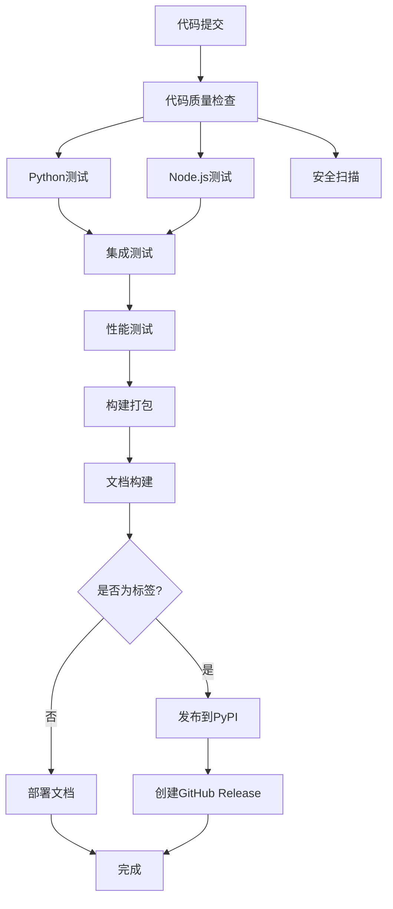

# UnityLangPX CI/CD 指南

本文档介绍UnityLangPX项目的持续集成和持续部署流程。

## 目录

1. [概述](#概述)
2. [CI/CD流程](#cicd流程)
3. [代码质量检查](#代码质量检查)
4. [测试策略](#测试策略)
5. [部署流程](#部署流程)
6. [本地开发](#本地开发)
7. [故障排除](#故障排除)

## 概述

UnityLangPX使用GitHub Actions实现完整的CI/CD流程，包括：

- **代码质量检查**：自动化代码格式、类型、安全性检查
- **多版本测试**：支持Python 3.9-3.12和Node.js测试
- **集成测试**：端到端功能验证
- **性能测试**：性能基准测试和回归检测
- **自动部署**：文档部署和包发布
- **安全扫描**：依赖漏洞和代码安全检查

## CI/CD流程

### 触发条件

CI/CD流程在以下情况下触发：

1. **推送到主分支**：`main`、`develop`
2. **创建Pull Request**：针对`main`分支
3. **创建标签**：触发发布流程

### 流程图



### 工作流阶段

#### 1. 代码质量检查

- **Flake8**：代码风格和质量检查
- **MyPy**：类型注解检查
- **Black**：代码格式检查
- **isort**：导入排序检查
- **Bandit**：安全漏洞检查

#### 2. 测试阶段

- **Python测试**：单元测试和覆盖率
- **Node.js测试**：Obsidian插件测试
- **集成测试**：端到端功能测试
- **性能测试**：基准测试和性能回归检测

#### 3. 构建和部署

- **包构建**：Python包构建和验证
- **文档构建**：Sphinx文档生成
- **安全扫描**：Trivy漏洞扫描
- **发布部署**：PyPI发布和GitHub Pages部署

## 代码质量检查

### 配置文件

- **`.flake8`**：Flake8配置
- **`pyproject.toml`**：Black、isort、mypy等工具配置
- **`.pre-commit-config.yaml`**：Pre-commit钩子配置

### 质量标准

| 检查项 | 工具 | 阈值 | 说明 |
|--------|------|------|------|
| 代码复杂度 | Xenon | B级 | 平均复杂度不超过B |
| 测试覆盖率 | pytest | >80% | 核心模块>90% |
| 安全漏洞 | Bandit | 0 | 无高危漏洞 |
| 类型检查 | MyPy | strict | 严格类型检查 |

### 本地运行

```bash
# 安装开发依赖
pip install -r requirements/dev.txt

# 安装pre-commit钩子
pre-commit install

# 运行所有质量检查
python scripts/quality_check.py

# 运行特定检查
flake8 src/
mypy src/
black --check src/
isort --check-only src/
bandit -r src/
```

## 测试策略

### 测试分类

1. **单元测试**：`tests/unit/`
   - 测试单个函数和类
   - 快速执行，高覆盖率
   - Mock外部依赖

2. **集成测试**：`tests/integration/`
   - 测试组件间交互
   - 使用真实服务
   - 端到端场景验证

3. **性能测试**：`tests/performance/`
   - 基准测试
   - 性能回归检测
   - 负载测试

### 测试标记

```python
import pytest

@pytest.mark.unit
def test_unit_example():
    """单元测试"""
    pass

@pytest.mark.integration
def test_integration_example():
    """集成测试"""
    pass

@pytest.mark.slow
def test_slow_example():
    """慢速测试"""
    pass

@pytest.mark.benchmark
def test_benchmark_example():
    """性能测试"""
    pass
```

### 运行测试

```bash
# 运行所有测试
pytest

# 运行特定类型测试
pytest -m unit
pytest -m integration
pytest -m "not slow"

# 生成覆盖率报告
pytest --cov=src --cov-report=html

# 运行性能测试
pytest --benchmark-only
```

## 部署流程

### 开发环境

- **分支**：`develop`
- **触发**：每次push
- **部署**：测试环境
- **通知**：Slack/邮件

### 生产环境

- **分支**：`main`
- **触发**：标签创建
- **部署**：PyPI、GitHub Pages
- **通知**：发布公告

### 发布流程

1. **准备发布**
   ```bash
   # 更新版本号
   bump2version patch  # 或 minor/major
   
   # 更新CHANGELOG
   # 编辑CHANGELOG.md
   ```

2. **创建标签**
   ```bash
   git tag -a v1.0.0 -m "Release version 1.0.0"
   git push origin v1.0.0
   ```

3. **自动发布**
   - CI/CD自动构建和发布
   - 创建GitHub Release
   - 发布到PyPI
   - 部署文档

## 本地开发

### 环境设置

```bash
# 克隆仓库
git clone https://github.com/unitylangpx/unitylangpx.git
cd unitylangpx

# 创建虚拟环境
python -m venv venv
source venv/bin/activate  # Linux/Mac
# 或
venv\Scripts\activate  # Windows

# 安装依赖
pip install -r requirements/dev.txt
pip install -e .

# 设置pre-commit
pre-commit install
```

### 开发工作流

1. **创建功能分支**
   ```bash
   git checkout -b feature/new-feature
   ```

2. **开发和测试**
   ```bash
   # 编写代码
   # 运行测试
   pytest
   # 检查质量
   python scripts/quality_check.py
   ```

3. **提交代码**
   ```bash
   git add .
   git commit -m "feat: add new feature"
   ```

4. **推送和PR**
   ```bash
   git push origin feature/new-feature
   # 创建Pull Request
   ```

### 调试CI/CD

```bash
# 使用act本地运行GitHub Actions
pip install act
act -j test

# 查看工作流日志
gh run list
gh run view <run-id>

# 重新运行工作流
gh run rerun <run-id>
```

## 故障排除

### 常见问题

#### 1. 测试失败

**问题**：测试在CI中失败但在本地通过

**解决方案**：
```bash
# 检查Python版本差异
python --version

# 检查依赖版本
pip freeze

# 清理缓存
pytest --cache-clear

# 使用相同环境
docker-compose -f .github/docker-compose.test.yml up
```

#### 2. 质量检查失败

**问题**：代码质量检查不通过

**解决方案**：
```bash
# 自动修复格式问题
black src/
isort src/

# 查看具体问题
flake8 src/
mypy src/

# 修复后重新检查
pre-commit run --all-files
```

#### 3. 构建失败

**问题**：包构建失败

**解决方案**：
```bash
# 检查构建配置
python -m build --wheel --universal

# 验证包
twine check dist/*

# 清理重建
rm -rf build/ dist/
python -m build
```

#### 4. 部署失败

**问题**：部署到PyPI失败

**解决方案**：
```bash
# 检查认证
twine check dist/*

# 测试上传
twine upload --repository testpypi dist/*

# 检查版本冲突
pip search unitylangpx
```

### 调试技巧

1. **启用详细日志**
   ```yaml
   # 在GitHub Actions中
   - name: Debug
     run: |
       set -x
       your-command
   ```

2. **使用调试断点**
   ```python
   import pdb; pdb.set_trace()
   # 或
   import ipdb; ipdb.set_trace()
   ```

3. **保存调试信息**
   ```yaml
   - name: Save debug info
     if: failure()
     run: |
       docker logs ${{ job.container.id }}
       kubectl logs pod/${{ job.pod }}
   ```

### 性能优化

1. **缓存策略**
   ```yaml
   - name: Cache dependencies
     uses: actions/cache@v3
     with:
       path: ~/.cache/pip
       key: ${{ runner.os }}-pip-${{ hashFiles('**/requirements*.txt') }}
   ```

2. **并行执行**
   ```yaml
   strategy:
     matrix:
       python-version: [3.9, 3.10, 3.11, 3.12]
   ```

3. **资源限制**
   ```yaml
   jobs:
     test:
       runs-on: ubuntu-latest
       timeout-minutes: 30
   ```

## 最佳实践

### 1. 代码提交

- 使用[约定式提交](https://www.conventionalcommits.org/)格式
- 提交信息清晰明确
- 一个提交只做一件事

### 2. 分支管理

- `main`：生产分支
- `develop`：开发分支
- `feature/*`：功能分支
- `hotfix/*`：热修复分支

### 3. 测试编写

- 单元测试快速且独立
- 集成测试覆盖关键流程
- 性能测试建立基准线

### 4. 文档维护

- 及时更新API文档
- 记录重要变更
- 提供使用示例

## 更多信息

- [GitHub Actions文档](https://docs.github.com/en/actions)
- [pytest文档](https://docs.pytest.org/)
- [代码质量工具](https://github.com/PyCQA)
- [发布流程](release_checklist.md)